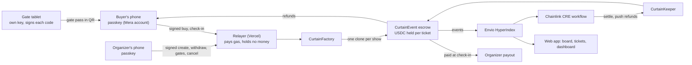

# Curtain

**Pay-on-entry ticket escrow on Monad.** Your money is held until the show happens. When you walk in, it's paid to the
organizer at the door. If the show doesn't happen, it comes back to you automatically.

[](https://github.com/abdoulore/Curtain/actions/workflows/test.yml)

- **Live:** https://curtaintickets.vercel.app (Monad testnet, demo money)
- **Demo video:** _placeholder, the final cut is published here by Oct 13_
- **Built for:** Monad Metropolis, Track 02 (Consumer Products and Payments)

| Contract (Monad testnet, chain 10143) | Address | Deploy tx |
| --- | --- | --- |
| CurtainFactory | [`0xd22f6eb4...83bF`](https://testnet.monadvision.com/address/0xd22f6eb461A97b9cA1b66837AfAb2E8D937F83bF) | [`0x50f7b66b...0b10`](https://testnet.monadvision.com/tx/0x50f7b66bfde281e7d4584bb94bf97c3bd6fe45edd38ee521206064f99f270b10) |
| CurtainEvent implementation | [`0x33Bda352...dD8`](https://testnet.monadvision.com/address/0x33Bda35276C3582eD2129d54a63a21725C8cbdD8) | same tx |
| Demo show (a clone, made with `createEventFor`) | [`0xa01EFA5B...CB0E`](https://testnet.monadvision.com/address/0xa01EFA5Bc1cDB594A6Ec70d2Bd1b1138B496CB0E) | [`0xd5136a0c...7e89`](https://testnet.monadvision.com/tx/0xd5136a0c1f91824e62331ce575c1a9435f109c386c6b35edafa4d63521077e89) |
| CurtainKeeper (Chainlink CRE receiver) | [`0xC157558d...a18E`](https://testnet.monadvision.com/address/0xC157558da8C7d90EAE75C38A850515567ED5a18E) | [`0xc99d3cca...6346`](https://testnet.monadvision.com/tx/0xc99d3cca7f4df86e1a218b0a1db3427817b55277be83f3270b5c1c83e3356346) |

All four are source-verified on Sourcify (exact match). Earlier deployments are listed in the
[appendix](#retired-deployments).

## The problem

Ticket buyers in Lagos pay weeks ahead for shows that get postponed, moved or quietly cancelled. Getting that money
back means chasing an organizer on WhatsApp, and often it never comes. Screenshots of tickets are forged and resold,
so the person at the door can't tell a real ticket from a copy. Organizers carry the cost of that distrust: buyers
wait until the last minute, and touts take the margin. Nothing in the usual flow ties the money to the show actually
happening.

## The solution

Every show is its own escrow contract. A ticket's money is **Protected** from purchase until its holder walks in.
At the gate, the buyer scans a rotating code and confirms with their **fingerprint or Face ID**; the contract verifies
that passkey signature onchain and pays that ticket's money to the organizer in the same transaction. After the show,
if at least half the tickets sold were checked in, the rest is paid out; if not, or if the organizer cancels, every
unscanned ticket is **Refunded** automatically, with nobody having to approve it.

Buyers never see a wallet, a seed phrase or a gas fee. Resale is capped at face value, and a resold ticket only opens
the door for the new holder's passkey.

## 60-second demo

1. **Laptop:** open the [demo gate](https://curtaintickets.vercel.app/gate/pair#VWK_HMurzy8GAjn50kG6lmEhcTW0ZXgbjZDH9G9RwvXea_zUYhDRepxMAu_Zq0TrhPK_wg).
   It pairs the browser as a gate for "Curtain Demo Night" and shows a QR code that changes every few seconds.
2. **Phone:** open https://curtaintickets.vercel.app/e/demo, type a first name, tap **Get my ticket** and confirm with
   your fingerprint or Face ID. ₦1,500 is now protected.
3. **Phone:** scan the laptop's code, tap **Check in**, confirm. The laptop shows **ADMIT**, the phone says
   **You're in**, and ₦1,500 is paid to the organizer.
4. **Scan again** with the same ticket: **DO NOT ADMIT**, refused by the contract.
5. **Money board:** https://curtaintickets.vercel.app/board/demo shows what is protected, paid and refunded, live.

Phones: Android with Chrome and Google Password Manager (tested on a Samsung with fingerprint), or iPhone with Safari
on iOS 18+ and iCloud Keychain. Open links in Chrome or Safari, not inside WhatsApp, Instagram or X. To run your own
show, open https://curtaintickets.vercel.app/organizer/new, then use **Add a gate device** on the dashboard.

## Why Monad

- **Passkeys are verified onchain.** Monad has the P-256 precompile at `0x0100` (EIP-7951), so the escrow checks a
  real WebAuthn fingerprint or Face ID signature in the check-in transaction itself: 6,900 gas for the curve check,
  about 97k for the whole relayed check-in. The same check in Solidity costs about 240k more. The door decision and
  the payout are one atomic step, with no server deciding who gets in. Proof from a real phone:
  [canary run](#canary-a-biometric-passkey-verified-onchain).
- **Fast enough for a queue.** A check-in confirms in about a second, so the gate turns green while the guest is still
  standing there.
- **Cheap enough to relay everything.** Curtain pays gas for every buyer, holder, gate and organizer action, so nobody
  needs MON.

## Architecture



## Sponsors

### Mera: one passkey for the account and the door

Buyers and organizers sign up with Mera, which derives their account from the passkey's PRF output. Mera does not
expose the passkey's public key, so Curtain passes Mera a custom WebAuthn client that makes the same browser calls and
also keeps the P-256 key from the registration response. The result is **one fingerprint prompt that creates both the
account that pays and the key that opens the door**. The account signs EIP-712 buys, listings and organizer actions;
the same credential signs the WebAuthn assertion the escrow verifies at the gate.

PRF also powers **Send to my phone**: a claim key derived from the passkey's PRF output lets a laptop hand a ticket to
a phone with a different passkey, and the link dies when it is used or revoked. Spike page:
[`frontend/public/spike/mera.html`](frontend/public/spike/mera.html). Run on Samsung Android with Google Password
Manager, Oct 5: sign-up and sign-in derived the same account with one prompt each, that account signed a `BuyIntent`,
and the same credential checked in onchain,
[`0xc1dbf3b1...a3d3`](https://testnet.monadvision.com/tx/0xc1dbf3b165613de318b68bf23a1e8a387686cfbb61fcd5d4c6611863e31aa3d3).

### Envio: the live state layer

[`indexer/`](indexer) is an Envio HyperIndex that follows `CurtainFactory`, registers each escrow it creates, and keeps
per-show totals (protected, paid, withdrawn, refunded), every ticket's holder and state, show names and venues, paired
gates, and an activity feed. Everything that reads state goes through it:

- the money board's totals and feed (a WebSocket log subscription adds each moment instantly; Envio confirms it);
- **My tickets** on any device, an organizer's **Your shows**, the dashboard's gate list, door list and sales chart;
- the upcoming shows on the home page;
- the Chainlink workflow's list of shows to check.

On Oct 5 its totals matched the contracts exactly, and a new purchase appeared in the index 680 ms after it
confirmed. If the indexer is slow or down, every view falls back to reading the escrows directly.

### Chainlink CRE: automation with no custody

Nobody has to remember to settle a show or refund a cancelled one. [`cre/curtain-keeper`](cre/curtain-keeper) is a CRE
workflow that runs every 5 minutes. It finds candidate shows through Envio (plus a fixed list in case the indexer is
down), asks `CurtainKeeper.pending(shows)` on Monad what is due, and if anything is, signs one report that the
forwarder delivers to `CurtainKeeper.onReport`, which settles shows and pushes refunds in batches of 10.

[`src/CurtainKeeper.sol`](src/CurtainKeeper.sol) **holds no money and has no special role**: `settle` and `pushRefunds`
are open to anyone, so the workflow only saves people from having to call them. It accepts reports only from the
forwarder, acts only on genuine Curtain clones (matched by code hash), and logs `Skipped` instead of reverting, so one
stale show can't block the rest. Simulated with `cre workflow simulate --broadcast` on Monad testnet: one report
settled an ended show as not confirmed and refunded all 5 buyers ([runs](#chainlink-cre-runs)).

## How the escrow works

- **Buy:** the buyer's account signs an EIP-712 `BuyIntent` and a USDC permit; the relayer submits. The ticket binds to
  the buyer for refunds and to their passkey for the door.
- **Check in:** a paired gate device signs each rotating code (`GatePass`). The challenge covers chain, show, ticket,
  gate nonce and block, is single use and at most 300 blocks old. The contract checks the passkey's WebAuthn assertion
  (user present and verified, Curtain's rpId) and moves that ticket's price from protected to paid.
- **After the show:** anyone can `settle`. If at least half the tickets sold were checked in (a fixed 5000 bps), the
  show is confirmed and the rest is paid out; otherwise every unscanned ticket is refundable. `cancel` does the same
  immediately. `pushRefunds` pays holders in batches; a failed transfer marks one ticket RefundOwed without blocking
  the rest.
- **Resale and gifts:** listings are capped at face value, the buyer pays the seller directly, and the ticket's
  protected money and passkey move to the new holder. Gift links are signed by a one-time claim key.
- **Per person:** each account holds at most the show's limit (default 4), counted across buys, resale and gifts.
- **Accounting invariant:** `totalPaidIn == released + refunded + escrowed`, and the token balance always equals
  `escrowed + released - withdrawn`, fuzzed over every action.

## Security model

- **The relayer never holds ticket money.** It pays gas and submits what buyers, holders, gates and organizers sign.
  Money moves only between buyers, each show's escrow and the organizer's payout address, fixed at creation.
- **The door is decided onchain.** A ticket is admitted only with a code from a paired gate, a fresh challenge and the
  holder's passkey. A replayed scan, an expired code, someone else's fingerprint and a seller after resale are all
  [refused by the contract](#every-red-case-refused-onchain).
- **Passkeys sync with the user's Apple or Google account**, so the ticket works on every device signed in to it.
  The fingerprint or Face ID never leaves the phone; Curtain only receives the signature.
- **Relayer safety:** top-ups fail closed in production without the shared limit store (Upstash), each relay route
  has a daily gas ceiling, and top-ups pause when the treasury or relayer runs low.
  https://curtaintickets.vercel.app/api/health reports all of it.
- **Keys are separate, one job each:** relayer, treasury, one key per gate device, and organizers' own passkeys. The
  organizer key for the demo show is never on Vercel.

## Tests and CI

| Suite | Tests | Where |
| --- | ---: | --- |
| Contracts (`forge test`) | 127 | 59 escrow, 18 keeper, 14 canary, 10 show creation, 8 gate pass, 8 per-person limit, 5 held threshold, 5 invariants |
| Web app (`npm test` in `frontend/`) | 177 | 27 files: passkeys and key recovery, error wording, copy and contrast checks, gate passes, top-up limits, gas ceilings, the money board's live moves, ticket states, create-show typed data, posters, calendar files and more |
| Indexer (`npm test` in `indexer/`) | 3 | full show lifecycle, settlement and resale rebinding, show details and gates |
| CRE workflow (`bun test` in `cre/curtain-keeper/`) | 9 | discovery, pending jobs and reports with the SDK's mocks |

Counts verified Oct 7 (the indexer suite runs in CI, since Envio's CLI has no Windows build). CI runs all four
suites, `forge fmt --check`, typechecks, lint and production builds on every push: see the badge above and the
[workflow runs](https://github.com/abdoulore/Curtain/actions/workflows/test.yml).

Every unhappy path asserts its exact error: replay (`ChallengeAlreadyUsed`), stale and future codes, second scan
(`TicketNotActive`), wrong passkey (`InvalidAssertion`), wrong domain (`WrongRpId`), non-gate (`NotGate`), before doors,
resale above face value (`PriceAboveCap`), over-withdraw (`ExceedsReleased`), strangers (`NotOrganizer`,
`BadSignature`), sold out, sales closed, forged or replayed intents, wrong sale (`WrongSale`), refund rules
(`NotRefundable`, `NothingToRefund`), revoked gift links (`NoClaimKey`), settlement timing (`NotSettleable`) and the
per-person limit (`TooManyTickets`).

## Repository

| Path | What |
| --- | --- |
| [`src/`](src) | `CurtainFactory`, `CurtainEvent`, `CurtainKeeper`, and the `PasskeyCanary` that proved the primitive first |
| [`test/`](test) | Foundry tests |
| [`script/`](script) | Deploy scripts |
| [`frontend/`](frontend) | Next.js app and relayer API on Vercel; [`frontend/scripts/`](frontend/scripts) holds the end-to-end and screenshot runs |
| [`indexer/`](indexer) | Envio HyperIndex |
| [`cre/curtain-keeper/`](cre/curtain-keeper) | Chainlink CRE workflow |
| [`docs/screens/`](docs/screens) | Screenshots at 375 px and 1440 px |

```sh
forge test                              # contracts
cd frontend && npm test                 # web app
cd cre/curtain-keeper && bun test       # CRE workflow
```

## License

MIT

---

# Appendix

## Deployment details

The demo show sells 200 tickets at 1 USDC (shown as ₦1,500; Circle testnet USDC
`0x534b2f3A21130d7a60830c2Df862319e593943A3`, EIP-712 domain `USDC` version `2`), up to 4 per person, doors open
now, ends 30 days after deploy, rpId `curtaintickets.vercel.app`. The held threshold is a contract constant: half the
tickets sold.

```sh
forge script script/DeployCurtain.s.sol --rpc-url monad_testnet --broadcast --slow --gas-estimate-multiplier 110
CURTAIN_FACTORY=0xd22f6eb461A97b9cA1b66837AfAb2E8D937F83bF KEEPER_DEMO_SHOWS=false forge script script/DeployKeeper.s.sol --rpc-url monad_testnet --broadcast --slow --gas-estimate-multiplier 110
```

The relayer key deploys and submits; the organizer key only signs the demo show's `CreateShow`; the gate key's address
is the demo show's first gate device.

| Role | Address | Where it lives |
| --- | --- | --- |
| Relayer (submits buys, check-ins, resales, claims, show creation and organizer actions; pays gas) | `0xf3B5F191cDd51d78ec117B0f09239c532Fb6d0F6` | Vercel |
| Gate devices (sign gate passes, never pay gas) | one per paired tablet, for example `0x31f7e1FcBD820cA29cece6Ac6386172557511fF5` | the tablet's browser |
| Treasury (sends demo USDC for top-ups) | `0x4f930C2CF8Da49F8Ddf362DC77AC8754563D9d06` | Vercel |
| Organizers and payouts | the organizer's passkey account; `0x0ab5384bC2669C2B9E26Fcf40e4B31af2e294937` for the demo show | never on Vercel |

Limits: `/api/topup` allows 3 top-ups per network per day and 10 per hour across everyone; `/api/relay/create` allows
5 shows per network per day and 20 per hour; each relay route has a daily gas ceiling (for example 150M gas for buys,
75M for check-ins), overridable with `GAS_CEILING_<ROUTE>`. Counts live in Upstash Redis.

## Retired deployments

Earlier contract versions, kept for the runs recorded below. Their shows keep working, and tickets held for them
still appear in My tickets.

| Version | Factory | Demo show | Keeper |
| --- | --- | --- | --- |
| Held threshold set per show (until Oct 7) | `0x5e2366072A6db0e0734bBb8976F86a7Eac6Fb3b6` | `0x5562bF1ccBabcF2f060239f9D241Ba9661217135` | `0xc16008D869fC44E2af4d217C23adc2eCFdC57219` |
| Before the per-person limit | `0x13391D9E0dD62d01c62821671F47A12eE320Ca58` | `0x4Dc6c2eC3899C28BADdFe872B09c6c41C7dD653D` | `0xe2F693e95eA2A2ff45fA08374198714CD49E58B1` |
| Earlier | `0x00CC023C3BFB01eb3E5470247c7976966b04d0Db` | `0xd3F22B52F74D658318C29E0475E1833214eCA005` | `0x010F096F8dC260b68A07025C00404aaf9F33bADe` |
| Earliest | `0x4F50565d089A2D12117e6dc52375C2c8F748Bfc0` | `0x8df8b6D5CeF9FE34B1a6bE4E130a589Be4bB5cB7` | none |

## Every red case, refused onchain

The app simulates each action first, so a refused scan or a bad request costs nothing. To show that the contract
itself is what says no, [`frontend/scripts/red-cases.mjs`](frontend/scripts/red-cases.mjs) sends every red case as a
real transaction with a fixed 400k gas limit on the demo show of the time. Each one reverted onchain, Oct 6:

| Case | Contract error | Reverted tx |
| --- | --- | --- |
| Replaying the same scan | `ChallengeAlreadyUsed` | [`0x2d0958f5...a45d`](https://testnet.monadvision.com/tx/0x2d0958f52a8919ff63a1104344e68a6af2e997a75b8cc03154363863e137a45d) |
| Second scan of a used ticket | `TicketNotActive` | [`0x3c9300b9...8af3`](https://testnet.monadvision.com/tx/0x3c9300b97409c137cf9cc1c20a1c5393ff9672ad8140907216e1fe4e32468af3) |
| Someone else's fingerprint | `InvalidAssertion` | [`0x6c27ff4b...7c2b`](https://testnet.monadvision.com/tx/0x6c27ff4b947fe8128f36fed269ebb115dca770dfb35895b8c81f835689e67c2b) |
| Gate code older than 300 blocks | `ChallengeExpired` | [`0x6641475a...daa3`](https://testnet.monadvision.com/tx/0x6641475a7c43fe38a187d596123d7e6af0012ab091ad17b909bcf3a8601fdaa3) |
| Code from a screen that isn't a paired gate | `NotGate` | [`0x47eb06f2...e0ac`](https://testnet.monadvision.com/tx/0x47eb06f27d030f68865eae20df2c3f7cad52c2dc6a7d9aab6a27d0844986e0ac) |
| Resale above face value | `PriceAboveCap` | [`0x2306b0bd...a18f`](https://testnet.monadvision.com/tx/0x2306b0bd9228e78e714be9c7105fee5d0797808e24ca4ab95420fb207bffa18f) |
| Seller at the door after reselling | `InvalidAssertion` | [`0xf27ae8b1...1bd7`](https://testnet.monadvision.com/tx/0xf27ae8b149244e474ad22123dc6f7a0861b9860df94ec2e9676ddb62113c1bd7) |
| Organizer withdraws more than was paid | `ExceedsReleased` | [`0x286ed4ac...e4ad`](https://testnet.monadvision.com/tx/0x286ed4acb11db91107695ea1344098e1ecd7cc2df7a059662d1ed7774370e4ad) |
| A stranger signs a cancellation | `BadSignature` | [`0x97a102d2...4b80`](https://testnet.monadvision.com/tx/0x97a102d2ed0034df3417534dc390647804a56108520775759ee25582d4b44b80) |
| A fifth ticket for one person (Oct 7, `limit-case.mjs`) | `TooManyTickets` | [`0xcfe168fe...f12a`](https://testnet.monadvision.com/tx/0xcfe168feeb7459845537b489259b93aaa18777f9676051225be1498cb7abf12a) |

```sh
cd frontend && BASE_URL=https://curtaintickets.vercel.app npm run red-cases
```

## Real-device and end-to-end runs

Real passkey run on factory `0x13391D9E...Ca58`, Oct 6: Samsung Android (fingerprint, Mera passkey account
`0xc1ACaC62...5291`) as organizer and buyer, a Windows laptop paired as the gate. Show "Magic show"
[`0x3A9cF10b...FAd3`](https://testnet.monadvision.com/address/0x3A9cF10b9E427a472bd06145027826eD6D24FAd3).

| Step | Signed by | Tx |
| --- | --- | --- |
| Create the show on `/organizer/new` | organizer passkey (`CreateShow`) | [`0xb3c079aa...7cc7`](https://testnet.monadvision.com/tx/0xb3c079aaa72bc0a4afffd4ddef9069a45965eab0ca59dafc3e8833b701a97cc7) |
| Pair the laptop as a gate | organizer passkey (`SetGate`) | [`0x1afafe36...e1003`](https://testnet.monadvision.com/tx/0x1afafe36978502fcbae5705da698cac1edc4d5297ca222c9b5fa3d2a298e1003) |
| Buy ticket #1 | buyer passkey | [`0x04c6f259...b5`](https://testnet.monadvision.com/tx/0x04c6f2594105ce870c3d6a8488ddcf7e4cad43822c768630d9cea8c54c6bd9b5) |
| Check in at the paired laptop gate | buyer passkey, gate pass from the laptop's key | [`0xacb80b38...eac2`](https://testnet.monadvision.com/tx/0xacb80b3891b63a3bff4a5e89cd697b5aee98b96c4eb8bb1c6382baaeb510eac2) |
| Withdraw ₦1,500 (1 USDC) | organizer passkey (`Withdraw`) | [`0x60d01e6a...31cd`](https://testnet.monadvision.com/tx/0x60d01e6a7398745bd4ee71bf3f1fd29662e1082e02b59eb24e60418921ce31cd) |
| Buy ticket #2, then "Sell at face value" | buyer passkey (`List`) | [`0xa686f3c6...f79e`](https://testnet.monadvision.com/tx/0xa686f3c6260c8d55ba36366494f1c7806e54c1ddacd166a4a4bf115a2cf7f79e) |
| Ticket #2 bought on resale; the seller received 1 USDC | test buyer | [`0x9ab8bd73...ccaf`](https://testnet.monadvision.com/tx/0x9ab8bd73a40788ce3e778fb6371d2bad5e403fc836e25e10d402d27e7b22ccaf) |

The organizer never held MON; the relayer paid every transaction.

Show with a poster on factory `0x5e236607...b3b6`, Oct 7 (`npm run e2e:create`, which also uploads a poster and
description signed by the organizer): created
[`0xbd4ca594...c3d3`](https://testnet.monadvision.com/tx/0xbd4ca594b76fb424db26b5fd36132cb46890179bd0383ed9c152a2ec8223c3d3),
then pair a gate, admit a guest and withdraw ₦1,500.

End-to-end runs through the app's relayer API on an earlier deployment, Oct 5 (an EOA stands in for the passkey
account, since Mera accounts are plain EOAs and sign the same typed data):

| Run | Step | Tx |
| --- | --- | --- |
| `npm run e2e:create` | organizer creates "E2E Comedy Night" by signature | [`0xf825c8ce...11ee`](https://testnet.monadvision.com/tx/0xf825c8cefb5bb71ba2aee44cd263a2cbfd5821620235e0b02a56256f188511ee) |
| | pair a gate device (signed SetGate) | [`0xf9991173...c225`](https://testnet.monadvision.com/tx/0xf9991173137974eb8ac3c0a4a6f6021221b4072ff3ab6e9d91302c72da19c225) |
| | guest checks in with a pass signed by that device | [`0x714f87d2...65ae`](https://testnet.monadvision.com/tx/0x714f87d2dd55118f663593b403650d30acb35b983e2666e833fb8e54122f65ae) |
| | withdraw ₦1,500 (exactly 1 USDC); the organizer never held MON | [`0x79ab2fb0...c612`](https://testnet.monadvision.com/tx/0x79ab2fb0395c4a84abe0e4e08d93faa81acdf10516a4977503968e439879c612) |
| `npm run e2e:resale` | holder lists at face value (above face value is refused, `PriceAboveCap`) | [`0xd8edb17c...8102`](https://testnet.monadvision.com/tx/0xd8edb17cabdde96cd77c225538563b55a79b658f740b02678ab5f459c2e78102) |
| | second buyer buys on resale; the seller is paid directly | [`0xe1cbdc02...709e`](https://testnet.monadvision.com/tx/0xe1cbdc02eb8355a9cf7d145d3b9aa88c470b96eec5cf2b75692cf7e84708709e) |
| | seller's passkey at the door: refused (`InvalidAssertion`), no gas | none |
| | new holder checks in | [`0xf57e2e81...fafc5`](https://testnet.monadvision.com/tx/0xf57e2e8139dc63c42766765b75e200d80722d1bf45425c71636a90db5c3fafc5) |
| `npm run e2e:relay` | gasless buy, then check-in relayed with a gate pass (replay refused) | [`0x0ba0938d...18ba`](https://testnet.monadvision.com/tx/0x0ba0938de6d6855c280a11a111223a3d50e556da74cf46027d19923a883c18ba) |
| `npm run e2e:claim` | send to my phone, revoke, claim, phone checks in | [`0x03c50fe2...f50`](https://testnet.monadvision.com/tx/0x03c50fe220ab0b74b4d8db8068d7973a6b16232ca4944d4a8a1a583ecba1ef50) |

Earlier end-to-end runs:

| Run | Step | Tx |
| --- | --- | --- |
| `npm run e2e:relay` | gasless buy | [`0xb9842e57...37a7`](https://testnet.monadvision.com/tx/0xb9842e5773939319b4e82aff40c74e5fa7ad251cb6d67a8e993f490ae1f937a7) |
| `npm run e2e:claim` | set a send-to-phone link | [`0xc9588b1c...4be6`](https://testnet.monadvision.com/tx/0xc9588b1c88e90de1b6a5ff84d3b822c67e03dbf08d3bdce6c9a8f55875ec4be6) |
| | revoke it (the phone's claim is then refused, `NoClaimKey`) | [`0xd0738ffb...b64c`](https://testnet.monadvision.com/tx/0xd0738ffb4f691095a5f448f877e357c9186d4409d5384dd409811443349bb64c) |
| | set a fresh link | [`0x3f46147a...1ab8`](https://testnet.monadvision.com/tx/0x3f46147a2b4ebbccc2ea24ebe104dc779474de208c44f10e466de3b9ca971ab8) |
| | phone claims (ticket rebinds to the phone's passkey; reusing the link is refused) | [`0x6b3a4de3...4b9e`](https://testnet.monadvision.com/tx/0x6b3a4de3016e51c7ec3f4cb7d8c90864428af6872ca7580df318276bece84b9e) |
| | phone checks in | [`0xfe276830...ea13`](https://testnet.monadvision.com/tx/0xfe276830027347d020baf04105d2be055f957f27e302f473c9e7b6fa1b73ea13) |
| `npm run e2e:organizer` | signed withdraw to the payout | [`0x59b180f6...9cb2`](https://testnet.monadvision.com/tx/0x59b180f6a8e30833f3f39e041199d68685404f88bb1de861380f749794509cb2) |
| | signed add gate | [`0x84fc7af6...6b4c`](https://testnet.monadvision.com/tx/0x84fc7af68dd270264e3eab824df421c0314221723a3c89d9a96b1b5bc2446b4c) |
| | signed remove gate (a stranger's signature is refused before any gas) | [`0xaab44704...fcb8`](https://testnet.monadvision.com/tx/0xaab4470411dab324250e0579f9539e6bba8049d45d98fa202a1d3962c4e2fcb8) |

Two-device run on an earlier deployment, Oct 5: Samsung Android (fingerprint) as the buyer, a Windows laptop as
the gate.

| Step | Result | Tx |
| --- | --- | --- |
| Gasless buy, ticket #4 | success | [`0xae206d9d...8902`](https://testnet.monadvision.com/tx/0xae206d9d7f13bc462fd735b5e80761d35d28b77b0e9dc0e2dfd0fcf7b8fe8902) |
| Check-in with fingerprint | green on phone and gate, 1 USDC paid to the organizer | [`0x82ce15ee...a2ae`](https://testnet.monadvision.com/tx/0x82ce15ee74ac0084589884596fc6bda74664700bb371a75bb836dbe3da7ca2ae) |
| Second scan of the same ticket | red on phone and gate, refused at simulation (`TicketNotActive`), no gas spent | none |

Laptop to phone on real devices, on an earlier deployment, Oct 5:

| Device | Path | Result | Tx |
| --- | --- | --- | --- |
| Windows laptop, Chrome | A: sign in with the passkey synced through Google Password Manager | same account as the phone (`0xc1ac...5291`) | |
| Windows laptop, Chrome | buy ticket #5 | success | [`0x025664c8...8954`](https://testnet.monadvision.com/tx/0x025664c8090e7e04efe438258447ed287e3f402525b953052602e95407728954) |
| Windows laptop, Chrome | B: Send to my phone (PRF claim key) | link set | [`0x7cdf456a...5e41`](https://testnet.monadvision.com/tx/0x7cdf456aa3553a3bc1684d5c1940000cfc6255e76a891b29bcf4474c8cc75e41) |
| Samsung Android, Chrome | B: scan and claim | claimed | [`0xfe965f93...e3ec`](https://testnet.monadvision.com/tx/0xfe965f938f9fdbbc18c80375810510b80c52726b0b0bda7940da040fe1dce3ec) |
| Samsung Android, Chrome | check in at the laptop gate, fingerprint | green | [`0xb160c881...c1b6`](https://testnet.monadvision.com/tx/0xb160c881abadf97bddcfb44e1e1a44d81b2855470450b11a9f88f231a93dc1b6) |

Mac and iPhone have not been run.

## Chainlink CRE runs

`cre workflow simulate --broadcast` (CRE CLI 1.37.0, SDK 1.23.0), Oct 5, against two shows made by
[`script/DeployKeeper.s.sol`](script/DeployKeeper.s.sol): one cancelled with 3 tickets, one ended with 2 tickets and
nobody checked in. This run used the keeper for an earlier contract version; the config now points at
`0xC157558da8C7d90EAE75C38A850515567ED5a18E`.

| Step | Result | Tx or log |
| --- | --- | --- |
| Deploy CurtainKeeper (Sourcify exact match) | [`0x010F096F...bADe`](https://testnet.monadvision.com/address/0x010F096F8dC260b68A07025C00404aaf9F33bADe) | [`0x6458f5da...5c2d`](https://testnet.monadvision.com/tx/0x6458f5da713f8c7c000b794feb94abfcdd7fc68e3c739037cb768caa517a5c2d) |
| Cancel the first show | 3 tickets refundable | [`0x9d50956a...514f`](https://testnet.monadvision.com/tx/0x9d50956aa2da0c930829410de08a5f9ac30d5beb888eacf72a573465e725514f) |
| Workflow run 1 | settled the ended show as not confirmed, refunded all 5 buyers 0.20 USDC each, in one report | [`0xf0b0c6d0...6290`](https://testnet.monadvision.com/tx/0xf0b0c6d010af6e6b95efa04b1a72ba4a41ed4eae1eb69d988704e3ac0ef06290), [log](docs/cre/simulate-broadcast-1.log) |
| Workflow run 2 | nothing due, no transaction | [log](docs/cre/simulate-broadcast-2-idle.log) |
| Shows found through Envio alone (config list empty) | 3 | [log](docs/cre/simulate-envio-discovery.log) |

```sh
cd cre && cre workflow simulate ./curtain-keeper --target staging-settings --broadcast
```

`cre/.env` holds `CRE_ETH_PRIVATE_KEY` for the simulation's transactions (gitignored). For a deployed workflow,
`CurtainKeeper.setForwarder` switches to the production KeystoneForwarder `0xF8344CFd5c43616a4366C34E3EEE75af79a74482`.

## Gas

From `forge test --gas-report` without the invariant runs (first-time storage writes, so an upper bound). Medians mix
direct and signed calls; the max is the signed, successful path.

| Function | Median | Max |
| --- | ---: | ---: |
| `createEvent` | 262,619 | 262,761 |
| `createEventFor` (signed, with name and venue) | 61,905 | 347,970 |
| `buy` | 272,009 | 272,009 |
| `checkIn` (max is relayed with a gate pass) | 84,308 | 97,188 |
| `withdraw` | 55,569 | 98,169 |
| `cancel` | 8,935 | 38,278 |
| `setGate` | 29,136 | 58,476 |
| `buyResale` | 33,362 | 163,938 |
| `listForResale` | 45,765 | 45,765 |
| `setClaim` | 34,956 | 47,206 |
| `claim` | 22,159 | 65,065 |
| `settle` | 9,517 | 19,638 |
| `pushRefunds` | 64,923 | 86,561 |
| `claimRefund` | 24,098 | 59,797 |

A gate pass costs about 4,300 gas over a direct gate call (one ECDSA recovery). A signed organizer action costs about
30k more than a direct call (one ECDSA recovery, a nonce write). Monad charges the gas limit, not the gas used, so the
relayer sends at the estimate plus 10%.

## Canary: a biometric passkey verified onchain

Before any product code, this repo proved the core primitive: a Monad contract verifies a real biometric WebAuthn
assertion from a phone, using the P-256 precompile at `0x0100` (EIP-7951) rather than a Solidity fallback.

- [`src/PasskeyCanary.sol`](src/PasskeyCanary.sol): `register(qx, qy)` binds a P-256 key to a ticket id.
  `checkIn(ticketId, gateNonce, challengeBlock, auth)` derives the challenge, rejects it if it is from the future,
  too old or already used, then verifies the assertion with OpenZeppelin `WebAuthn.verify` (UP and UV required).
- [`test/PasskeyCanary.t.sol`](test/PasskeyCanary.t.sol): real WebAuthn payloads built with `vm.signP256`. Covers valid
  check-in, replay, stale challenge, wrong key, tampered clientDataJSON, future challenge, cross-ticket reuse, missing
  UV, high-s and unknown ticket.
- [`web/index.html`](web/index.html): one static page that creates a passkey, registers it, signs a challenge with the
  device biometric, checks in, then replays the same assertion.

```sh
forge test -vv                               # Osaka EVM, P-256 precompile present
FOUNDRY_PROFILE=noprecompile forge test -vv  # Prague EVM, OZ falls back to Solidity
```

| Measurement (forge 1.7.1, OZ 5.7.0, solc 0.8.35) | Precompile (osaka) | No precompile (prague) |
| --- | ---: | ---: |
| `P256.verify` alone | 7,843 | 246,523 |
| `checkIn` call, excluding the 21k base and calldata | 45,406 | 286,190 |

Contract [`0x927e3b17...f0d2`](https://testnet.monadvision.com/address/0x927e3b171db648538072017c9fdb0e31f35bf0d2),
`maxChallengeAge` 300 blocks. Real run: Samsung Android, fingerprint, synced passkey (authenticator flags `0x1d` = UP,
UV, BE, BS; the flags prove user verification, the method is as reported by the tester).

| Step | Tx | Result |
| --- | --- | --- |
| `register` (ticket 2) | [`0x3c1ac448...5bfc`](https://testnet.monadvision.com/tx/0x3c1ac4489e92f79c0492e532de8c4c49cbff087e1abdaf9c66efe63036725bfc) | `Registered(2, burner, qx, qy)` |
| `checkIn` (fingerprint) | [`0x460cf435...4836`](https://testnet.monadvision.com/tx/0x460cf435051a74f4b1e1fd1782c8d23bf6a1c7d0881149805dc41869f5b54836) | `CheckedIn(2, 0x3aa4df34...dd78)`, 11 blocks after `challengeBlock` |
| replay of the same assertion | [`0x4a74961f...8a61`](https://testnet.monadvision.com/tx/0x4a74961fa32f710e54cbe09ff6020066ef3682d56fc6f162903b51eb17dc8a61) | reverted, `ChallengeAlreadyUsed(0x3aa4df34...dd78)` |

Which P-256 path ran, from `debug_traceTransaction` (callTracer) on the fingerprint check-in:

```
CALL       PasskeyCanary      gas 90379 (tx gas limit)
  STATICCALL 0x...0002 (sha256)  gas 132
  STATICCALL 0x...0002 (sha256)  gas 96
  STATICCALL 0x...0100 (P256VERIFY) gas 6900 -> 0x...01
```

`eth_estimateGas` for that `checkIn` was 82,163 including the 21k base and calldata; the Solidity fallback alone would
add about 240k. Monad charges the gas limit, and `receipt.gasUsed` equals the transaction's gas limit on every
transaction checked, so use `eth_estimateGas` or a call trace to see execution gas. A synthetic run with a
script-generated key (`script/SyntheticCheckIn.s.sol`,
[`0xe265d8ca...a046`](https://testnet.monadvision.com/tx/0xe265d8ca1d8819f7cf2f9324e758ab7a726eac0d87d439142d31f86a627da046))
shows the same 6,900 gas STATICCALL to `0x0100`.

```sh
cp .env.example .env   # a throwaway testnet key in PRIVATE_KEY
source .env
forge script script/Deploy.s.sol --rpc-url monad_testnet --private-key $PRIVATE_KEY --broadcast
```
